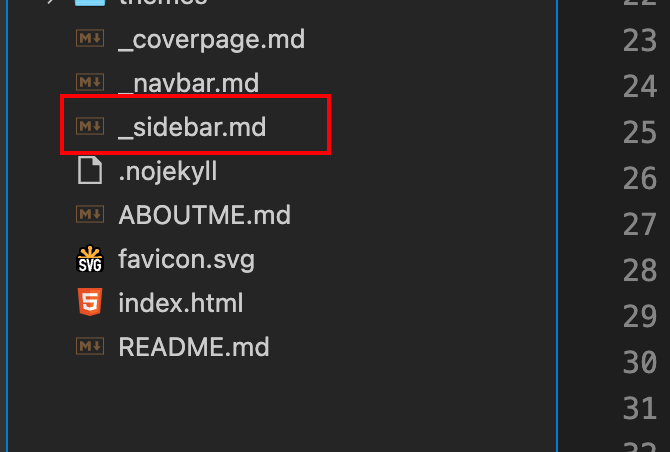

> ### 前言
>
> #### 效果图：
>
> 
>
> 
>
> 
>
> #### 搭建工具：
>
> - [docsify](https://docsify.js.org/#/zh-cn/) => 搭建
> - [GitHub](https://github.com) => 存放 / 部署
> - [Vercel](https://vercel.com/) => 部署

## 一、初始化项目

> 这里可以按照docsify的[官方文档](https://docsify.js.org/#/zh-cn/quickstart)去做一个快速上手

全局安装 `docsify-cli` 工具，可以方便地创建及在本地预览生成的文档。

```bash
npm i docsify-cli -g
```

初始化项目

```bash
docsify init ./docs
```

初始化成功后，可以看到 `./docs` 目录下创建的几个文件

- `index.html` 入口文件
- `README.md` 会做为主页内容渲染
- `.nojekyll` 用于阻止 GitHub Pages 忽略掉下划线开头的文件

直接编辑 `docs/README.md` 就能更新文档内容


**本地预览**

通过运行 `docsify serve` 启动一个本地服务器，可以方便地实时预览效果。默认访问地址 [http://localhost:3000](http://localhost:3000/) 

```bash
cd docs
```

```bash
docsify serve
```

> 更多命令行工具用法，参考 [docsify-cli 文档](https://github.com/docsifyjs/docsify-cli)。


## 二、自定义展示效果

> 这部分官方文档也写的很清楚，可以跟着文档一步一步走，也可以直接翻到最后，拿我写好的配置去用

### 定制侧边栏

在根目录下创建 `_sidebar.md`



首先配置 `loadSidebar` 选项，具体配置规则见[配置项#loadSidebar](https://docsify.js.org/#/zh-cn/configuration?id=loadsidebar)。

在`index.html`中加入如下配置

```html
<script>
  window.$docsify = {
    loadSidebar: true
  }
</script>
<script src="//cdn.jsdelivr.net/npm/docsify/lib/docsify.min.js"></script>
```

接下来就可以在`_sidebar.md`中配置路由了，使用相对路径配置即可，例如

```markdown
* 写在最前面
  * [前言](README.md)
* CodeProblems
  * [MacOS使用Vscode调试C](./docs/codeproblems/MacOS_Vscode_Debugger_C.md)
```

📢注意：需要在根目录下创建 `.nojekyll` 命名的空文件，阻止 GitHub Pages 忽略命名是下划线开头的文件。


### 封面

在根目录下创建`_coverpage.md`


在`index.html`中加入以下配置

```html
<script>
  window.$docsify = {
    coverpage: true
  }
</script>
<script src="//cdn.jsdelivr.net/npm/docsify/lib/docsify.min.js"></script>
```

然后就可以在`_coverpage.md`中加入封面文字了，例如

```markdown
<!-- _coverpage.md -->

# CodeJuziの技术文档
> 这是一份计算机技术学习资料

- Copyright © 2023 CodeJuzi All Rights Reserved.

[GitHub](https://github.com/dingxinliang88)
[关于作者](ABOUTME.md)
[开始阅读](README.md)
```


这样就完成了一个基本的博客（文档）啦，接下来就是各种写博客，加路由就好啦。

